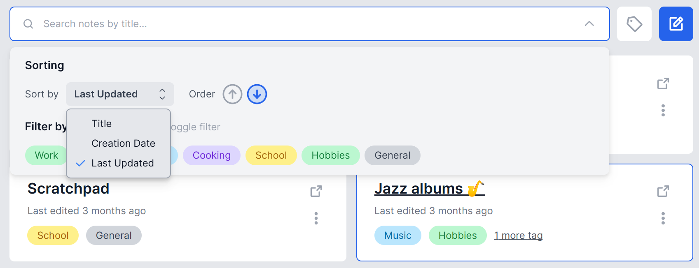
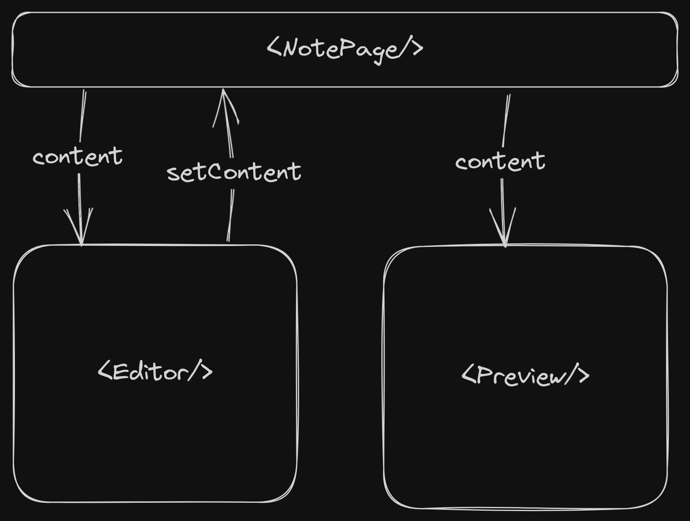
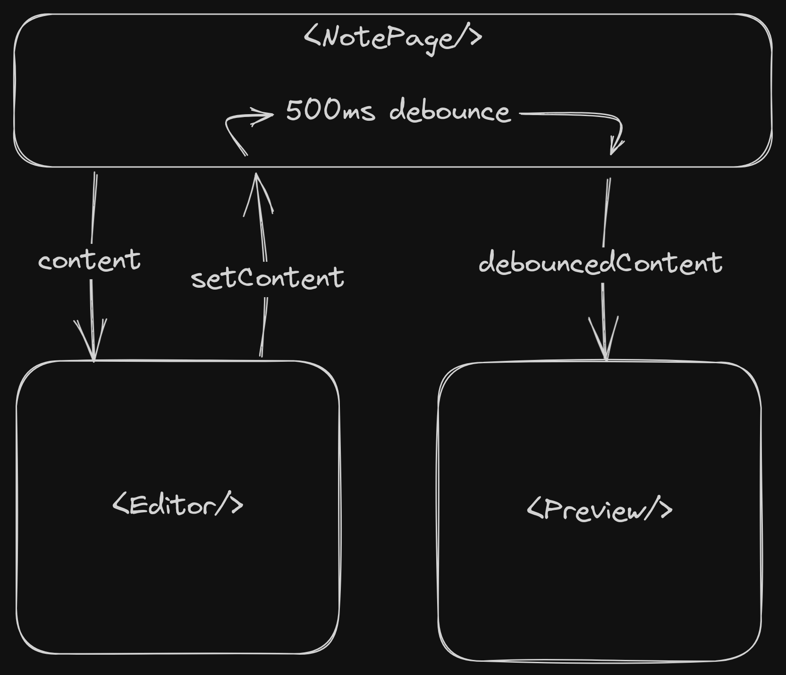
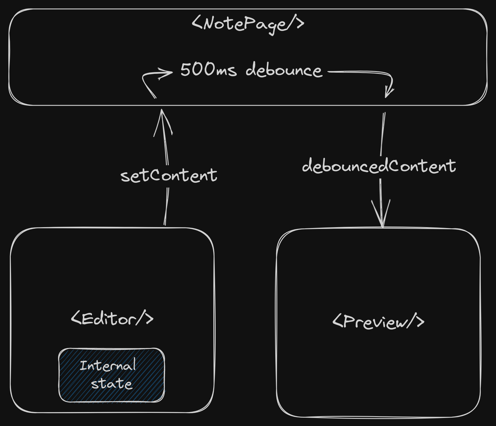
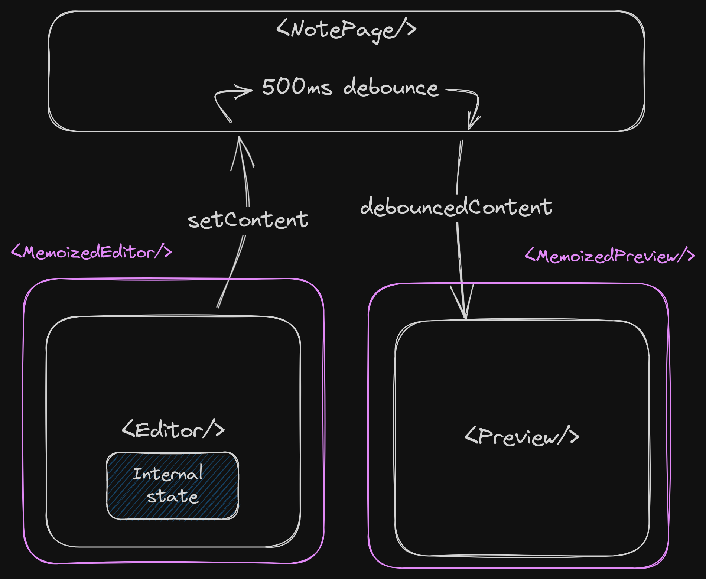

## Goals

The ultimate goal of replicating my VS Code setup was to create an online-first writing app that I would actually enjoy using, and that, given sufficient development time, could eventually replace VS Code as my go-to note-taking solution. As such, here are the main goals I had outlined for this project, in no particular order of significance:
- Build the app using the [T3 stack](https://create.t3.gg/) and deploy it to [Vercel](https://vercel.com/) and [Supabase](https://supabase.com/).
- Full¹ support for the [GitHub Flavored Markdown](https://github.github.com/gfm/) spec.
- Automatic note saving.
- Tags to group notes together by topic.
- A nice, fully responsive but easy-to-use UI.
- A search and sorting system.  
- Fully accessible UI components and keyboard navigation.
- Multiple social login options.

¹ *Well, just the important parts would be fine, too. The full spec is quite long.*

---
## Good UI design isn't all magic

Learning to code is hard, but at least the process is pretty cut and dry. If you're interested in a particular topic, you can read about it somewhere (Wikipedia, docs, books), watch a YouTube video or two, and put your newfound knowledge to use by solving a specific problem. Rinse and repeat until you get good at it. With coding (and Math, Science, etc.), it's usually pretty easy to gauge if you successfully learned and retained something.

But after reading Wathan and Schoger's [Refactoring UI](https://www.refactoringui.com/) to try learning some basic web design principles, I quickly noticed that the process isn't as straightforward with UI/UX stuff. Since design work is basically applied art, and not an exact science, what makes a particular design "good" or "bad" (mostly) depends on who you ask. That said, the book does provide some really great ideas for approaching web design methodically, most of which even made it to Tailwind CSS (spoiler: the authors are the creators of Tailwind).

At its core, a good UI is all about usability and consistency, not following design trends or expressing your innate artistic talent. Your app's design and visual identity should follow its functionality, and not the other way around. And the good news is that building usable and visually consistent UIs only requires choosing a few presets and sticking to a few basic rules.

For example, here's a great tip from the book for when you're starting from scratch.

> **Hold the color.** By designing in grayscale, you’re forced to use spacing, contrast, and size to do all of the heavy lifting. It’s a little more challenging, but you’ll end up with a clearer interface with a strong hierarchy that’s easy to enhance with color later.

The book is filled with these great tips to get you moving faster:
- **Be a pessimist.** Don’t imply functionality in your designs that you aren’t ready to build. If part of a feature is a nice-to-have, design it later. 
- **Don't over-invest.** Design in low-fidelity so that you can move fast, try out several iterations, and start building the real thing as soon as possible.
- **Define systems in advance.** Don't hand-pick values from a limitless pool any time you need to make a decision, start with a smaller set of options. Need a new shade of blue? Don't reach for the color picker—just choose from a set of 8-10 shades picked out ahead of time.
- **Use visual hierarchy.** Deliberately de-emphasize secondary and tertiary information and make an effort to highlight primary elements. The result is immediately more pleasing, even though the color scheme, font choice, and layout haven’t changed.

Below is the Figma file I created with all of the various iterations of the desktop and mobile designs for LuccaNotes.

<!-- <iframe style="border: 1px solid rgba(0, 0, 0, 0.1);" width="800" height="450" src="https://www.figma.com/embed?embed_host=share&url=https%3A%2F%2Fwww.figma.com%2Ffile%2F9Vnnbj7m862xY9C8uAF8Pn%2FLuccaNotes%3Ftype%3Ddesign%26node-id%3D0%253A1%26t%3DJC6R6ZdF1aqGYy2m-1" allowfullscreen></iframe> -->

Heading from left to right, you can see how I started designing the UI in grayscale and only much later added in color. I created several iterations for each page, trying out new layouts, adjusting the visual hierarchy in the page and inside individual components, removing redundancies, and using the Tailwind CSS defaults as much as possible.

---
## Building a design system

---
## Accessibility

Building accessible components from scratch is really hard. The sheer amount of edge cases, [ARIA standards](https://developer.mozilla.org/en-US/docs/Web/Accessibility/ARIA), and obscure APIs in enough to turn any solo dev away from tackling such a problem. But integrating a11y features is an extremely important step in making the internet more inclusive and usable for everyone.

Thankfully, unstyled component libraries such as [Radix UI](https://www.radix-ui.com/) and [Headless UI](https://headlessui.com/) provide common, high-quality, accessible components such as dropdowns, dialogs/modals, sliders, tabs, accordions and much more. You can layer your design system on top of these components and truly make them your own, with the nitty-gritty a11y tech already taken care of for you.

I opted to go with Headless UI because it integrates seamlessly with Tailwind CSS, my favorite CSS framework, and it also had all the components I needed. Be aware that the internal component state is accessed through [render props](https://legacy.reactjs.org/docs/render-props.html), which are a bit unwieldy and kinda outdated, but it works fine.

As an example, here is a [popover menu](https://headlessui.com/react/popover) I built for the search bar, which has its own [dropdown menu](https://headlessui.com/react/menu) and buttons inside a [radio group](https://headlessui.com/react/radio-group). The best part is that despite being a total a11y dum-dum, I was still able to build a custom component that can be navigated using only a keyboard or screen reader.



---
## Diffin', matchin', & patchin'

When you're building an online note-taking app, you'll eventually need to update the note's Markdown content on the backend every time a user saves the note. But do you send an entirely new copy of the whole document back to the server? Or do you send just a sequence of commands to update the existing copy in the DB? Of course, the latter is the better alternative here, but how exactly would you implement that? Well that's where [DMP](https://github.com/google/diff-match-patch) comes in.

DMP, short for "Diff-Match-Patch", is a collection of algorithms developed by Google back in 2006 to power the [operational transformation](https://en.wikipedia.org/wiki/Operational_transformation?useskin=vector) model for collaborative editing in Google Docs. According to the GitHub repo (which also contains cool visual demos), DMP can:

1. **Diff:** "Compare two blocks of plain text and efficiently return a list of differences."
2. **Match:** "Given a search string, find its best fuzzy match in a block of plain text. Weighted for both accuracy and location."
3. **Patch:** "Apply a list of patches onto plain text. Use best-effort to apply patch even when the underlying text doesn't match."

LuccaNotes uses the [JavaScript implementation](https://www.npmjs.com/package/diff-match-patch) of DMP to implement note saving, like so:
- On the frontend, we keep two different copies of the document in React state variables: the last saved version of the document (stale) and the current version of the document (fresh) in the text editor. We compare these copies to generate a set of diffs.
- These diffs are then used to generate a set of patches that, when applied to the stale version, will result in the fresh copy of the document.
- The patches are sent to the server using a tRPC mutation procedure and validated with a custom [Zod](https://zod.dev/) schema.

```ts
// src/pages/notes/[id].tsx

const NotePage = (props) => {
  // editor state
  const [prevEditorContent, setPrevEditorContent] = useState(props.content);
  const [editorContent, setEditorContent] = useState(props.content);

  // initialize diff-match-patch
  const dmp = useMemo(() => {
    return new DMP.diff_match_patch();
  }, []);

  // tRPC queries and mutations
  const noteQuery = api.notes.getSingle.useQuery({ id: props.noteId });
  const noteContentMutation = api.notes.updateContent.useMutation();
  const utils = api.useContext();

  // note saving function
  const saveNote = useCallback(() => {      
    // generates patches
    const patches = dmp.patch_make(prevEditorContent, editorContent);

    // call tRPC mutation on backend
    noteContentMutation.mutate(
      { id: props.noteId, patches },
      {
        onSuccess: (updatedNote, variables, context) => {
          void utils.notes.getSingle.invalidate({ id: variables.id });
          setPrevEditorContent(editorContent);
        },
      }
    );
  }, [
    // dependencies here...
  ]);

  return (
    // JSX markup here...
  )

}

```
- The server fetches the stale copy from the DB, applies the patches, and writes the new text content of the document back to the DB.
```ts
// src/server/api/routers/notes.ts

// tRPC procedures for notes
export const notesRouter = createTRPCRouter({
  updateContent: protectedProcedure
    .input(
      z.object({
        id: z.string().cuid(),
        patches: // custom schema for DMP patch objects
      })
    )
    .mutation(async ({ ctx, input }) => {
      // fetch note from DB
      const note = await prisma.note.findFirst({
        where: { id: noteId, userId: session.user.id },
        include: { tags: true },
      });    
      if (!note) throw new TRPCError({ code: "NOT_FOUND" });

      // compute and apply text patches
      const dmp = new DMP.diff_match_patch();
      const [newContent, results] = dmp.patch_apply(
        input.patches,
        note.content
      );

      // update note with new text content
      const updatedNote = await ctx.prisma.note.update({
        where: { id: input.id },
        data: { content: newContent, lastUpdated: new Date() },
        include: { tags: true },
      });
      return;
    }),
});
```
- If the mutation was successful, the frontend updates the stale copy to match the current state of the text editor and the cycle repeats.

As far as I can tell, this approach appears to work fine, but I'm not an expert on [version control](https://en.wikipedia.org/wiki/Version_control?useskin=vector) or [concurrency control](https://en.wikipedia.org/wiki/Concurrency_control?useskin=vector) or whatever. I genuinely have no idea if this could end up creating weird edge cases and lead to some inconsistent state. Oh well! ¯\\\_(ツ)_/¯

---
## React optimizations

One of the coolest parts about building LuccaNotes was learning more the internals of React. After running into some weird unresponsivess and input lag when building the note editing/preview page, I was forced to learn about all sorts of techniques to optimize my React code and deal with performance issues.

Below is a simplified diagram of what the React component tree for the note editing page initially looked like. Here, `<Editor/>` is a stand-in for [React Codemirror](https://uiwjs.github.io/react-codemirror/), a React implementation of [Codemirror](https://codemirror.net/), while `<Preview/>` is a stand-in for [react-markdown](https://remarkjs.github.io/react-markdown/), a Markdown to HTML renderer powered by [remark](https://github.com/remarkjs/remark).



Sounds simple enough right? The top-level `<NotePage/>` component stores the note's text content in its internal state. The `<Editor/>` receives the content through props to display as source code, and can also update it using a dispatch function. `<Preview/>` also gets the content via props, which it then uses to convert to HTML.

However, this naive approach led to some nasty issues quite early on.

### Slow re-renders

It was immediately noticeable that typing in the code editor felt incredibly slow. I would press a key on my keyboard, and the whole page would freeze up for a moment or two while React re-rendered the components on the page. Typing whole sentences was nearly impossible. 

I couldn't pinpoint any specific bottlenecks straight away and I had no idea how to approach this problem. But since I had loaded up a fairly long Markdown document for testing purposes (code snippets, images and plenty of text), I thought that maybe react-markdown was having a hard time re-rendering the full Markdown content into HTML.

So the first fix I made was adding value debouncing with [use-debounce](https://www.npmjs.com/package/use-debounce), i.e., waiting for the value of the editor's content to settle for a specified delay, say 500ms, and only then passing the debounced value as a prop to `<Preview/>`.



That might've improved the weird freezing behavior somewhat, but I couldn't tell for sure. Typing into the code editor still felt incredibly laggy, which meant that the unresponsiveness probably had something to do with the editor itself.

### Input lag

It took me a few days of banging my head on my keyboard to fix it, but I found out that the input delay was caused by a weird quirk with the React Codemirror component. 

As it turns out, unline regular `<input/>` and `<textarea/>` HTML elements, you're not supposed to pass any content to React Codemirror in props, because apparently the text content state is already managed by the editor internally. As far as state props go, you're only expected to pass in the initial content and an `onChange` event handler at most.

Now why this *absolutely essential* clarification of the component's internal logic is totally absent from [the docs](https://uiwjs.github.io/react-codemirror/) is beyond me. Maybe it's explained somewhere in the [upstream docs](https://codemirror.net/docs/). In any case, here's our updated diagram.



Now we're getting somewhere! The input lag was mostly gone, but the page still felt a bit slow, so I had to dig deeper.

### Memoizing components and functions

I came across this great article by Josh Comeau titled [Why React Re-Renders](https://www.joshwcomeau.com/react/why-react-re-renders/#its-not-about-the-props-2), where I learned that the idea thats component re-render just because their props change is actually **not true**. Here's why:

> When a component re-renders, it tries to re-render all descendants, regardless of whether they're being passed a particular state variable through props or not.
>
> Now, this seems counter-intuitive... If we aren't passing [a state variable] as a prop to [a child component], why would it need to re-render??
> 
> Here's the answer: it's hard for React to know, with 100% certainty, whether [said child component] depends, directly or indirectly, on the [...] state variable.

In fact, the only way to prevent this behavior is by making your component "pure" with `React.memo()`, meaning it will always create the same UI given the same set of props. This special wrapper *memoizes* your component and signals to React that it should only re-render it if any of the props change. It's worth noting that React's memo differs from [traditional memoization](https://en.wikipedia.org/wiki/Memoization?useskin=vector) because the components aren't actually cached.

We can create memoized versions of the `<Editor/>` and `<Preview/>` components, `<MemoizedEditor/>` and `<MemoizedPreview/>`, and since they both sit at basically the same level in the component tree, we'll need to raise the `setContent()` dispatch function up to the top-level page component, and then drill the state down back to the Markdown preview.

Also, don't forget to memoize function definitions passed to child components with the `useCallback()` hook ([view docs](https://react.dev/reference/react/useCallback#optimizing-a-custom-hook)). This lets React cache your functions between re-renders until its dependencies change, kinda like `useEffect()`. A smart combination of pure components and cached function callbacks will let you further optimize your app, avoiding expensive re-renders that could result in unresponsiveness.

Finally, this is what the component tree looks like in the production version of LuccaNotes.



And that's it! With these optimizations, the input lag is now completely gone, and the note editing page feels as snappy as can be.

---
## Deployment and hosting

### Vercel

Vercel is the best platform to host Next.js apps right now—after all, they're the creators and maintainers of Next. There are some other options too, like [Netlify](https://www.netlify.com/), [Railway](https://railway.app/), [AWS Amplify](https://aws.amazon.com/amplify/) or [AWS via SST](https://sst.dev/examples/how-to-create-a-nextjs-app-with-serverless.html) (using Lambda, Lambda@Edge, CloudFront, and S3), but they're not as great as Vercel's current serverless and edge offerings.  

I relied heavily on Vercel's preview deployments during development, which made it super easy to test my latest features live on the internet before merging PRs to `main`. And of course, Vercel is also hosting the production deployment deployment of LuccaNotes as well.

Vercel has a very generous free tier for hobby projects, and so far I haven't had to pay them a single penny to keep LuccaNotes up and running.

### Supabase

I tried a few options for hosting a relational database, including [Railway](https://railway.app/)'s PostgreSQL and [PlanetScale](https://planetscale.com/)'s Vitess (which is MySQL-compatible), but I chose to go with Supabase's managed Postgres database because it's entirely free and there's no restrictions on uptime. I had also been looking for an excuse to try out Supabase for a while too, so...

Setting up a new DB on Supabase is ridiculously simple. Just create a new project, copy the connection URL from the settings, paste it your .env (don't forget to change it back to your local DB), run `prisma db push` from your CLI, and that's it. Your schema is good to go and Supabase is ready for your production environment. You can also enable [row-level security](https://supabase.com/docs/guides/auth/row-level-security) for fine control over who gets to run certain operations against your DB. 

---
## Conclusion
